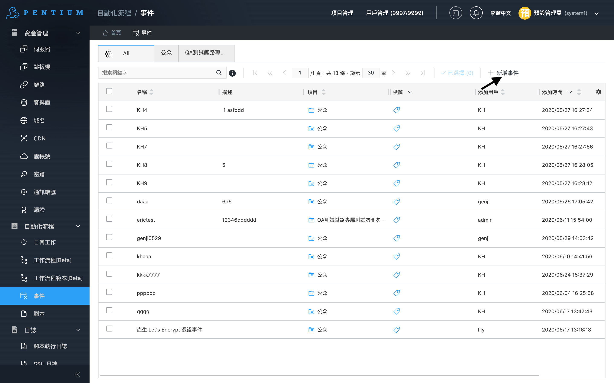
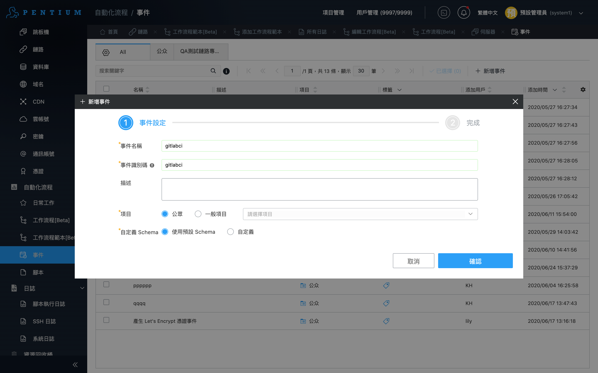
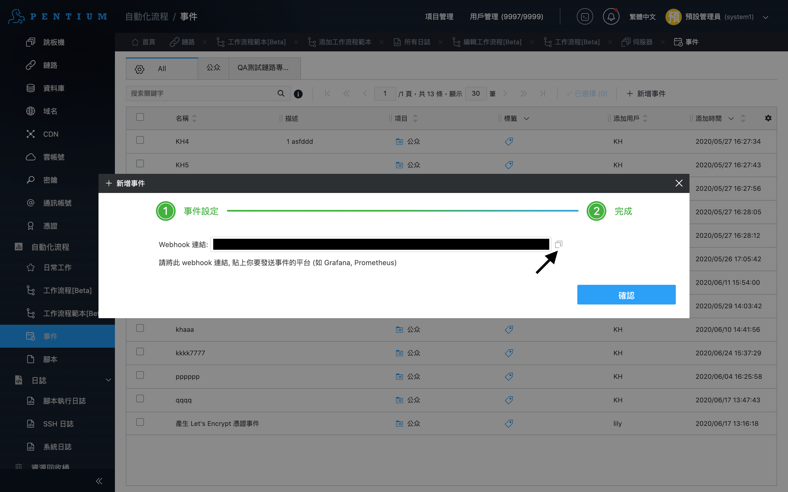
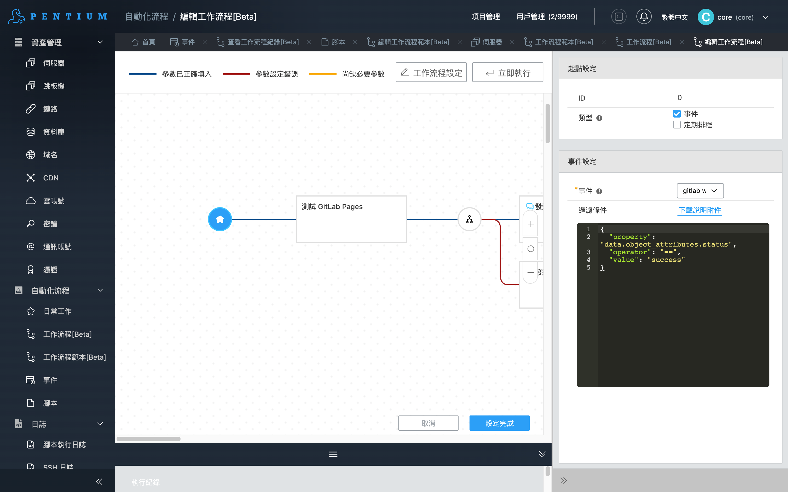

# Workflow example for GitLab CI intergration

這個範例展示了 Marvin 如何跟 GitLab CI 做整合，分別有兩個 Workflow

* 透過 Marvin Trigger GitLab CI: 執行之後可以對指定的 gitlab repo 執行 CI pipeline
* 接收 GitLab Webhook: 接收來自 GitLab CI 的 webhook，對網站做檢測，並透過 chatbot 送出檢測成功或是失敗 

GitLab 範例可以參考 [https://gitlab.com/pentium_network/demo-project](https://gitlab.com/pentium_network/demo-project)
當中的 GitLab CI 會在 master branch trigger，並且 deploy GitLab pages 到 [https://pentium_network.gitlab.io/demo-project/](https://pentium_network.gitlab.io/demo-project/)

## 透過 Marvin Trigger GitLab CI

請參考 `core.workflow.example.trigger-gitlab` 這個 workflow

Input 如下：

* token: gitlab token
* ref: branch or tag
* url

關於參數的細節可以參考 GitLab 的 [Trigger pipelines through the API](https://docs.gitlab.com/ee/ci/triggers/) 文件

## 接收 GitLab Webhook

請參考 `core.workflow.example.gitlab-webhook` 這個 workflow. 在安裝這個 workflow 之前首先得要在 Marvin 上面添加一個事件。添加事件的步驟如下：

1. 選擇事件

2. 輸入事件名稱

3. 複製 Webhook 連結

獲得 Webhook 連結之後，將連結貼到 GitLab Repo Webhook 設定上，細節請參考 [GitLab Webhook 文件](https://docs.gitlab.com/ee/user/project/integrations/webhooks.html)

在安裝 Workflow 的時候，記得起點要選取剛剛建立好的事件，並且可以在過濾條件設定你希望 trigger workflow 的條件判斷

設定完成之後，可以在 GitLab Webhook 處測試，如果 Workflow 有成功被叫起來就代表設定成功。